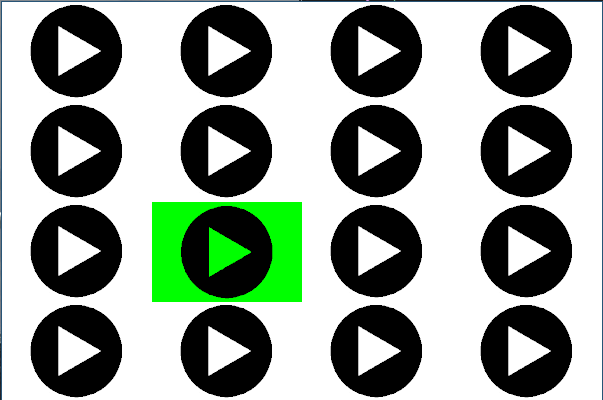

# Niilo22SoundBoard
Soundboard application made with SDL2



# How to run the program:
1. Install dependencies.
```
sudo apt install libsdl2-dev
sudo apt install libsdl2-image-dev
sudo apt install libsdl2-mixer-dev
```
2. Download files
3. Go to the directory with program's files, and compile with **make**
4. Run the executable **./niilosoundboard**
